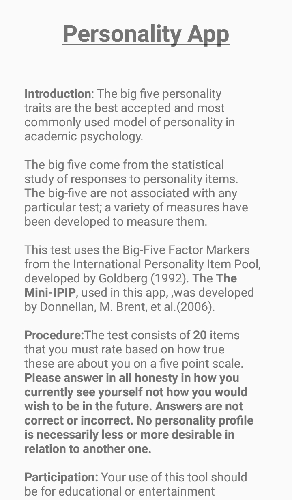
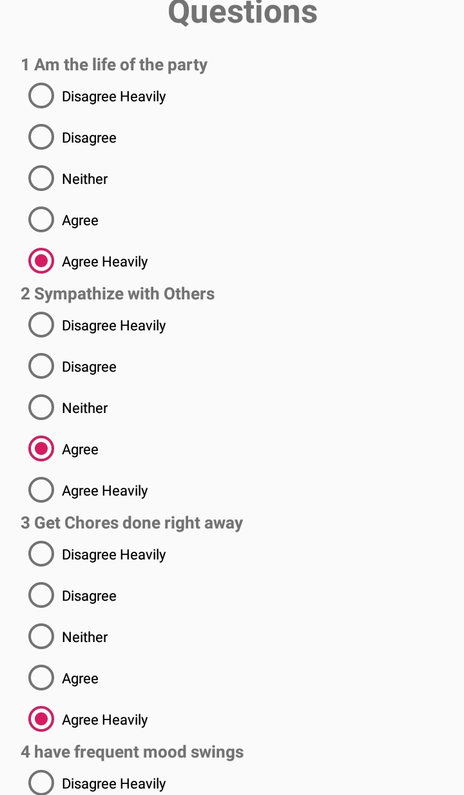
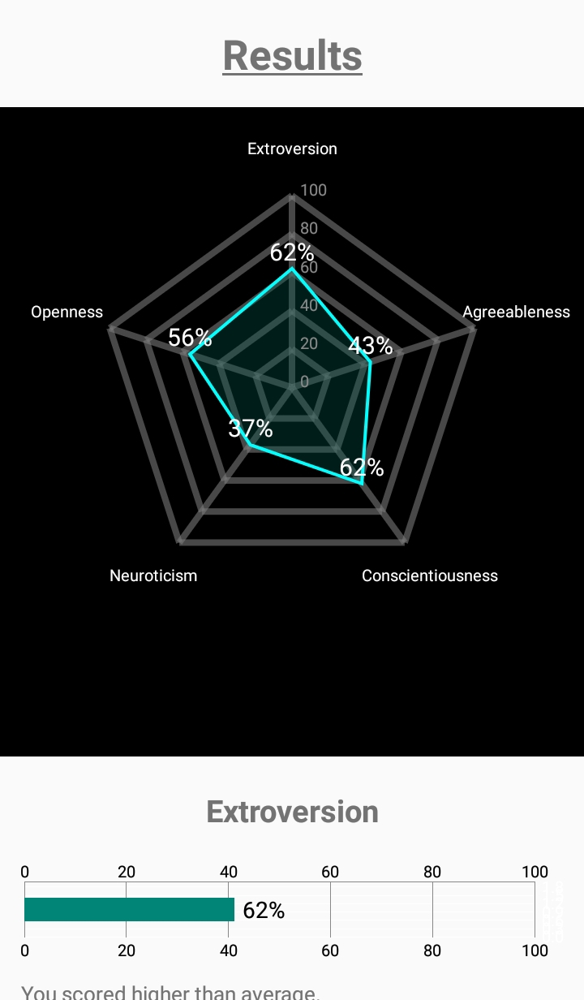
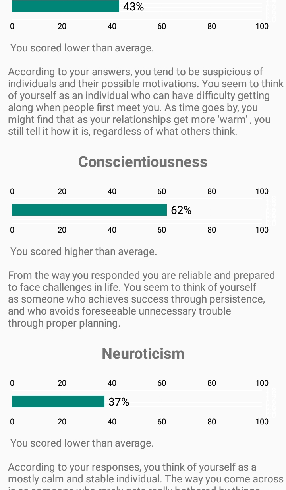

# Personality App #

  
  <body>
    <a href="https://play.google.com/store/apps/details?id=com.juanma.personality">
    
    <a/>
  </body>
 

# Introduction #
Discover about your personality and learn about yourself by using the mini ipip 20, a personality inventory proven to be scientifically reliable. 

# Screenshots #

  
  
  
  

# Libraries / Tools #

* Mini IPIP personality inventory : https://www.ncbi.nlm.nih.gov/pubmed/16768595
* MPA Android Chart: https://github.com/PhilJay/MPAndroidChart
* Admob
